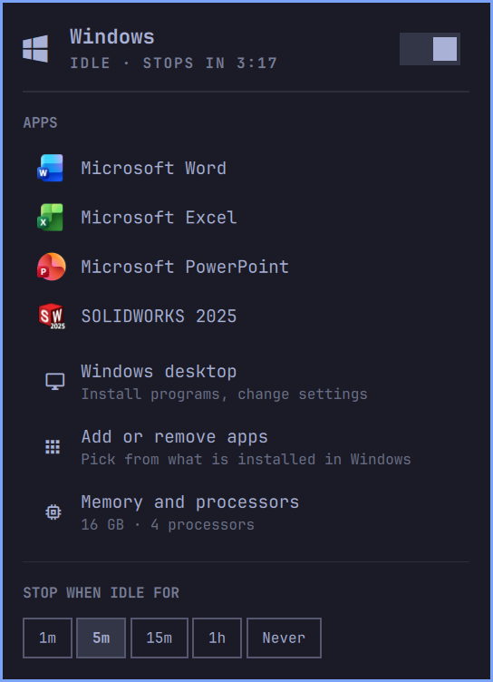

<h1 align="center">Windows Apps for Omarchy</h1>

<p align="center">
  Word, CorelDRAW, SOLIDWORKS or any other Windows program as an ordinary window on your Omarchy desktop,<br>
  opening and saving your Linux files where they are.
</p>

<p align="center">
  
</p>

Omarchy can already run Windows in a virtual machine (Install > Windows). This
plugin turns that VM into a source of apps:

- **Apps as windows.** Each Windows program opens in its own window that tiles,
  floats and switches like any other. No Windows desktop around it.
- **Your files, in place.** Double-click a `.docx`, `.cdr` or `.sldprt` in the
  file manager and it opens in the Windows app. Save, and the Linux file is
  updated. Nothing is copied into the VM and there is no sync folder.
- **Any program you install.** Install software from the Windows desktop, then
  tick it in a checklist. It gets a launcher entry, its real icon and its file
  types. Around 40 common programs are recognised by name; everything else
  works too.
- **The VM looks after itself.** It boots when you open an app (about 40
  seconds cold, 3 seconds once it is up) and shuts down a few minutes after you
  close the last one, so it is not holding memory while you are not using it.
- **A bar widget** shows whether Windows is running and what it is doing, opens
  apps, and starts or stops the VM.

## Install

You need Omarchy 4 with the Windows VM installed: Omarchy menu > Install >
Windows, or `omarchy-windows-vm install`. (If you install this plugin first, its
panel offers to do that for you.)

```bash
omarchy plugin add https://github.com/ryancoxrbc/omarchy-winapp --enable
~/.config/omarchy/plugins/ryancoxrbc.winapp/setup
```

The first line clones the plugin and puts the widget in the bar. The second
finishes the job: it puts the `winapp` command on your `PATH`, starts Windows
once to prepare it, and shows the programs it found so you can pick the ones
you want. Run it again whenever something seems off; it only fixes what is
missing.

## Adding an app

Say you want CorelDRAW.

1. **Install it in Windows.** Open the panel and choose *Windows desktop* (or
   run `winapp desktop`). Your Linux home folder is there under *This PC* as
   *home on …*, so you can run an installer straight out of `Downloads`. An
   installer can also be started from Linux directly:
   `winapp run ~/Downloads/CorelDRAW-Setup.exe`.
2. **Tick it.** Close the desktop window, choose *Add or remove apps* in the
   panel (or run `winapp manage`), tick CorelDRAW, press Enter.

That is all. CorelDRAW is now in the app launcher and the panel, with its own
icon, and `.cdr` files open in it.

Prefer the command line?

```bash
winapp scan corel          # what is installed, filtered
winapp add coreldraw       # add it by the id the scan showed
winapp coreldraw ~/Designs/logo.cdr
```

A program the scan does not show, or one you want set up differently, can be
described by hand:

```bash
winapp add signtool --name "Sign Tool" \
    --exe 'C:\Program Files\SignTool\signtool.exe' \
    --ext sgn,plt --default
```

## How your files reach Windows

When an app starts, your home folder is redirected into the Windows session as
`\\tsclient\home`. Opening `~/Designs/logo.cdr` hands the app
`\\tsclient\home\Designs\logo.cdr`; it reads and writes the real file.

- In a Windows file dialog, your home folder is under *This PC* and pinned to
  *Quick access*.
- A file outside your home folder (a USB stick, another disk) is redirected
  automatically when you open it.
- To share less than your whole home folder, or more than it:

  ```bash
  winapp shares                         # what Windows can reach
  winapp share add work /mnt/projects   # appears as \\tsclient\work
  winapp share remove home              # then share only what you choose
  ```

- Omarchy's own shared folder, `~/Windows`, still works alongside this, and the
  setup fixes a quirk where files added to it from Linux did not show up in
  Windows.

File names that Windows cannot spell (containing `< > : " | ? *` or ending in a
space or a dot) are refused with a message instead of failing oddly.

## Next to Omarchy's Microsoft web apps

Omarchy can also install Word, Excel and the rest as web apps (Install >
Service > Microsoft). Those are browser windows onto office.com; these are the
real programs. The two get along:

- The web apps are called "Microsoft Word" and so on, the same as the real
  ones. When both are installed, the Windows ones show up in the launcher as
  **Microsoft Word (Windows)** so you can tell them apart. The name changes by
  itself when you add or remove the web apps.
- Double-clicking a document opens the Windows program; the web apps do not
  open files.
- Removing the web apps from Omarchy's menu leaves these alone, and the other
  way round.
- To keep only the web app in the launcher but still open documents in the real
  one: `winapp add word --no-menu`.

Set `"windowsSuffix"` to `"always"` or `"never"` in the settings if you would
rather have the suffix everywhere or nowhere.

## The panel

Click the Windows icon in the bar, or bind a key to
`omarchy-shell ryancoxrbc.winapp toggle`.

| | |
|---|---|
| The switch | Start or stop the VM. Stopping with apps open asks first. |
| An app | Open it. Boots Windows first if needed. |
| Windows desktop | The full desktop, for installing programs and changing settings. |
| Add or remove apps | The checklist of installed programs. |
| Memory and processors | How much of this computer Windows gets. |
| Stop when idle for | How long the VM stays up after the last app closes. |

Keyboard: `↑` `↓` or `j` `k` to move, `Enter` to activate, `←` `→` on the idle
row, `d` for the desktop, `a` to add apps, `m` for memory and processors, `r` to
refresh, `Esc` to close.

The icon can be hidden while Windows is off, in Setup > Plugins or with
`omarchy bar set ryancoxrbc.winapp hideWhenStopped true --json`.

## Memory and processors

Windows gets the memory and processors you chose when you installed the VM. To
change them, use *Memory and processors* in the panel, or:

```bash
winapp resources                     # what it has now, and what this computer has
winapp resources --ram 8 --cores 4   # either option alone works too
```

This rewrites the VM's configuration through Omarchy's own helper, so it asks
for your password once. Windows apps have to be closed, and the new values
apply the next time Windows starts. The disk and everything on it are left
exactly as they are.

## Passwords

Omarchy starts and stops the Windows VM through Docker. If you have turned on
*sudoless Docker*, nothing here ever asks for a password.

If you have not (the Omarchy default), Omarchy asks for your password each time
the VM starts and each time it stops, including when it stops by itself after
sitting idle. The setup offers to waive that:

```bash
winapp passwordless on    # or: off, status
```

This installs one polkit rule that lets your user run exactly two actions of
Omarchy's VM helper, start and stop, without a prompt. Creating, changing or
removing the VM still asks. It is a much smaller grant than sudoless Docker,
which makes your user equivalent to root.

## Commands

```
winapp <app> [file...]       open an app, optionally on files
winapp open <file>           open a file with whatever Windows uses for it
winapp run <program> [file]  run a program by Windows path, or a Linux-side .exe/.msi
winapp explorer [folder]     browse a Linux folder in Windows Explorer
winapp desktop               the whole Windows desktop

winapp manage                tick the installed programs you want
winapp scan [text]           list what is installed in Windows
winapp add <id> [options]    add a program        winapp remove <id>
winapp apps                  list your apps       winapp icons   refetch icons

winapp start | stop | status
winapp idle <minutes>        0 = never stop by itself
winapp resources [--ram <GB>] [--cores <n>]   the VM's memory and processors
winapp shares | share add <name> <folder> | share remove <name>

winapp setup | doctor [--deep] | logs | passwordless on|off | uninstall
```

`winapp help` has the full list.

## Settings

`~/.config/winapp/config.json`:

| Key | Default | Meaning |
|---|---|---|
| `idleMinutes` | `5` | Stop the VM this long after the last app window closes. `0` never does. |
| `shares` | home as `home` | Folders redirected into Windows. |
| `scale` | `"auto"` | `"auto"` follows the focused monitor; or a percentage such as `150`. |
| `windowsSuffix` | `"auto"` | Add " (Windows)" to a launcher name: `"auto"` only when another app has the same name, `"always"`, or `"never"`. |
| `helperWindowFix` | `true` | Keeps programs such as CorelDRAW from freezing; see [how it works](docs/how-it-works.md#the-helper-window-fix). |
| `rdpArgs` | `[]` | Extra FreeRDP arguments for every session, for example `["/microphone"]` or `["/kbd:layout:0x0407"]`. |

`~/.config/winapp/apps.json` is the app list. It can be edited by hand; run
`winapp sync` afterwards to rebuild the launcher entries. Each app has an `id`,
`name` and `exe`, and optionally `args`, `icon`, `ext` (file types that are its
own), `opens` (types it can also open), `default` (`true`: always the default
app for its own types; `false`: never; unset: only for types nothing on Linux
opens), and `panel` / `menu` set to `false` to hide it there (hidden from the
launcher, it still opens its file types).

## When something is wrong

```bash
winapp doctor          # checks every piece and says how to fix what fails
winapp doctor --deep   # also starts Windows and tests it from the inside
winapp logs            # the latest session log
```

[docs/troubleshooting.md](docs/troubleshooting.md) covers the usual suspects.

## Good to know

- **Security.** Sharing your home folder gives programs inside the Windows VM
  the same access to your files that you have. That is what makes "open in
  place" work, and it is the same trade you make with any app you run, but a
  VM you use for untrusted software should get a narrower share (see above).
- **One app session.** All Windows apps share one Windows session. Opening a
  second app moves the first one's windows across to a new connection; they
  blink once and carry on.
- **Desktop or apps, not both.** A desktop edition of Windows shows one session
  at a time, so the full desktop and single apps cannot be open together.
  winapp says so when you try; close the one to use the other. (The same goes
  for Omarchy's own *Windows* launcher, which additionally shuts the VM down
  when its window closes. `winapp desktop` does not.)
- **Housekeeping needs the session.** `winapp scan`, `manage` and `icons` need
  that session to themselves and ask you to close Windows apps and the desktop
  first.
- **Store apps** (the ones without a real `.exe`) are not found by the scan.
- **HiDPI.** Windows renders at your monitor's scale; set `scale` if you prefer
  another.

How it all fits together, and why it is built this way, is in
[docs/how-it-works.md](docs/how-it-works.md).

## Uninstall

```bash
winapp uninstall                                       # --purge also removes your app list
omarchy plugin remove ryancoxrbc.winapp
```

The Windows VM itself is Omarchy's and is left alone.

## Status

Developed and tested on Omarchy 4.0 with FreeRDP 3.31 and Windows 11. Both
ways of reaching the VM have been run end to end on the same machine: with
sudoless Docker, and with Docker access switched off so that starting and
stopping go through Omarchy's password prompt, with and without `winapp
passwordless on`. It has not yet been run on a second machine. If something
misbehaves, `winapp doctor` and an issue with `winapp logs` attached are very
welcome.

## License

MIT. Not affiliated with Microsoft or with any of the programs named here.
